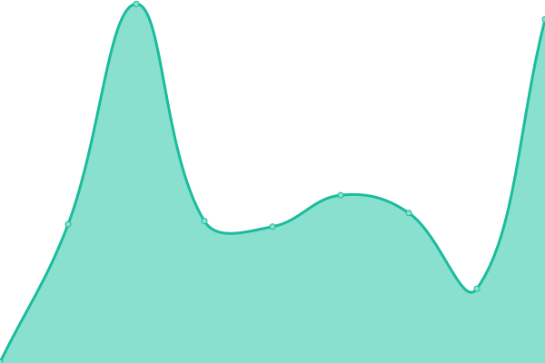
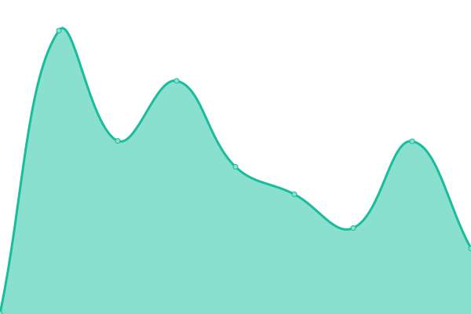

# [📈 Live Status](https://saifdev-org.github.io/uptime): <!--live status--> **🟧 Partial outage**

This repository contains the open-source uptime monitor and status page for [saifdev.org](saifdev.org), powered by [Upptime](https://github.com/upptime/upptime).

With [Upptime](https://upptime.js.org), you can get your own unlimited and free uptime monitor and status page, powered entirely by a GitHub repository. We use [Issues](https://github.com/saifdev-org/uptime/issues) as incident reports, [Actions](https://github.com/saifdev-org/uptime/actions) as uptime monitors, and [Pages](https://saifdev-org.github.io/uptime) for the status page.

<!--start: status pages-->
<!-- This summary is generated by Upptime (https://github.com/upptime/upptime) -->
<!-- Do not edit this manually, your changes will be overwritten -->
<!-- prettier-ignore -->
| URL | Status | History | Response Time | Uptime |
| --- | ------ | ------- | ------------- | ------ |
|  [Site](https://www.saifabdelrazek.com) | 🟥 Down | [site.yml](https://github.com/SaifA8K/uptime/commits/HEAD/history/site.yml) | 

 329ms
     
 | 

<a href="https://saifdev-org.github.io/uptime/history/site">100.00%</a>
    

|  [saifmarks - frontend](https://marks.saifdev.org) | 🟥 Down | [saifmarks-frontend.yml](https://github.com/SaifA8K/uptime/commits/HEAD/history/saifmarks-frontend.yml) | 

 322ms
     
 | 

<a href="https://saifdev-org.github.io/uptime/history/saifmarks-frontend">99.47%</a>
    

|  [saifurls - frontend](https://urls.saifdev.org) | 🟥 Down | [saifurls-frontend.yml](https://github.com/SaifA8K/uptime/commits/HEAD/history/saifurls-frontend.yml) | 

 301ms
     
 | 

<a href="https://saifdev-org.github.io/uptime/history/saifurls-frontend">100.00%</a>
    

|  [saifapi](https://api.saifdev.org) | 🟩 Up | [saifapi.yml](https://github.com/SaifA8K/uptime/commits/HEAD/history/saifapi.yml) | 

 678ms
     
 | 

<a href="https://saifdev-org.github.io/uptime/history/saifapi">100.00%</a>
    

|  [saifmarks - backend](https://api.marks.saifdev.org/test) | 🟩 Up | [saifmarks-backend.yml](https://github.com/SaifA8K/uptime/commits/HEAD/history/saifmarks-backend.yml) | 

 777ms
     
 | 

<a href="https://saifdev-org.github.io/uptime/history/saifmarks-backend">100.00%</a>
    

|  [Umami - selfhosted](https://umami.saifdev.org) | 🟥 Down | [umami-selfhosted.yml](https://github.com/SaifA8K/uptime/commits/HEAD/history/umami-selfhosted.yml) | 

 329ms
     
 | 

<a href="https://saifdev-org.github.io/uptime/history/umami-selfhosted">99.64%</a>
    

<!--end: status pages-->

[**Visit our status website →**](https://saifdev-org.github.io/uptime)

## 📄 License

- Powered by: [Upptime](https://github.com/upptime/upptime)
- Code: [MIT](./LICENSE) © [Anand Chowdhary](https://anandchowdhary.com), supported by [Pabio](https://pabio.com)
- Data in the `./history` directory: [Open Database License](https://opendatacommons.org/licenses/odbl/1-0/)
